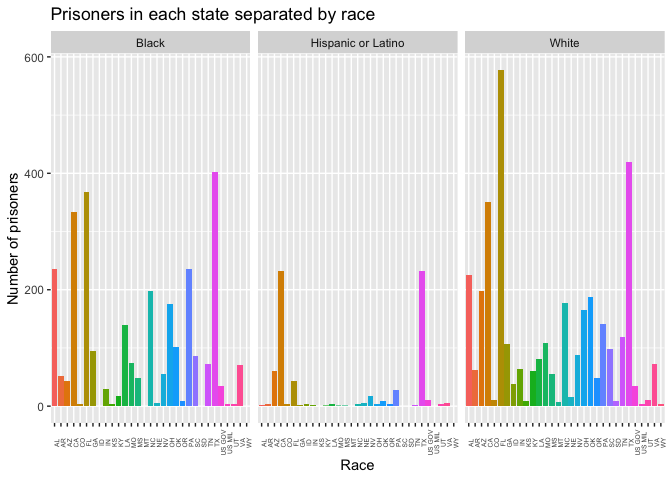

<!-- README.md is generated from README.Rmd. Please edit that file -->

# CondemnedData

<!-- badges: start -->


<!-- badges: end -->

The goal of CondemnedData is to determine the different types of
prisoners on death row. Specifically, the goal of this dataset is to
identify prisoners who were on death row, who moved off of death row and
examine the specifics of their particular sentence. This package adds
better naming to the variables and isolates the year or birth for each
prisoner as a new column in the dataset. It also selects a subset of the
10 most descriptive predictors from the original larger dataset.

## Installation

You can install the released version of CondemnedData from
[CRAN](https://CRAN.R-project.org) with:

``` r
install.packages("CondemnedData")
```

And the development version from [GitHub](https://github.com/) with:

``` r
# install.packages("devtools")
devtools::install_github("jfrank21/CondemnedData")
```

## Example

This is an example of the type of analysis that can be conducted using
this dataset. The plot below shows a comparison of the number of
prisoners in each state, separated by race.

``` r
modified_Death_Row <-
  filter(Death_Row, race == "Black" | race == "White" | race == "Hispanic or Latino")
ggplot(
  modified_Death_Row,
  aes(x = state, fill = state)
) +
  geom_bar() +
  facet_wrap(~race) +
  labs(x = "Race", y = "Number of prisoners", 
       title = "Prisoners in each state separated by race") +
  theme(
    axis.text.x = element_text(angle = 90, size = 5),
    legend.position = "none"
  )
```



Looking at the graph it seems that most states have a high number of
white prisoners, however most states have a similar number of black
prisoners if not more. The states with the most prisoners are Florida,
Texas and California.
